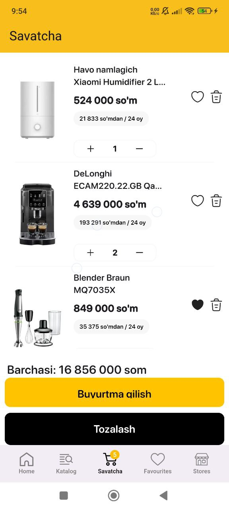
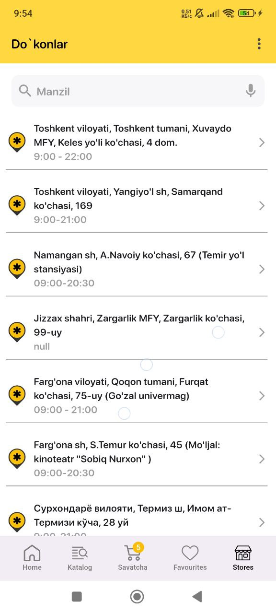

Welcome to the **Texnomart App Clone** repository! This is a Flutter-based application that mimics the official **Texnomart** app. It is built using a variety of modern tools and state management techniques to provide a seamless user experience.

---

### 📱 **App Overview**

Texnomart is an online store specializing in electronics and home appliances. This repository contains a clone of the **Texnomart** official app, which replicates the UI and functionality of the original. The app is designed and developed using Flutter, with various tools and libraries that enhance its performance and user experience.

---

### ⚙️ **Technologies Used**

- **Flutter**: A UI toolkit for building natively compiled applications from a single codebase.
- **BLoC**: Business Logic Component to manage app state efficiently.
- **Dio**: A powerful HTTP client for making network requests.
- **Retrofit**: Used to handle REST API calls in a more efficient way.
- **Get_it**: A service locator for dependency injection.
- **Hive**: A lightweight and fast NoSQL database for storing data locally.
- **Yandex Map**: For geolocation and maps integration.
- **Freezed**: A library for making immutable data classes and unions.

<table>
  <tr>
    <td></td>
    <td></td>
    <td></td>
  </tr>
  <tr>
    <td></td>
    <td></td>
    <td></td>
  </tr>
</table>
